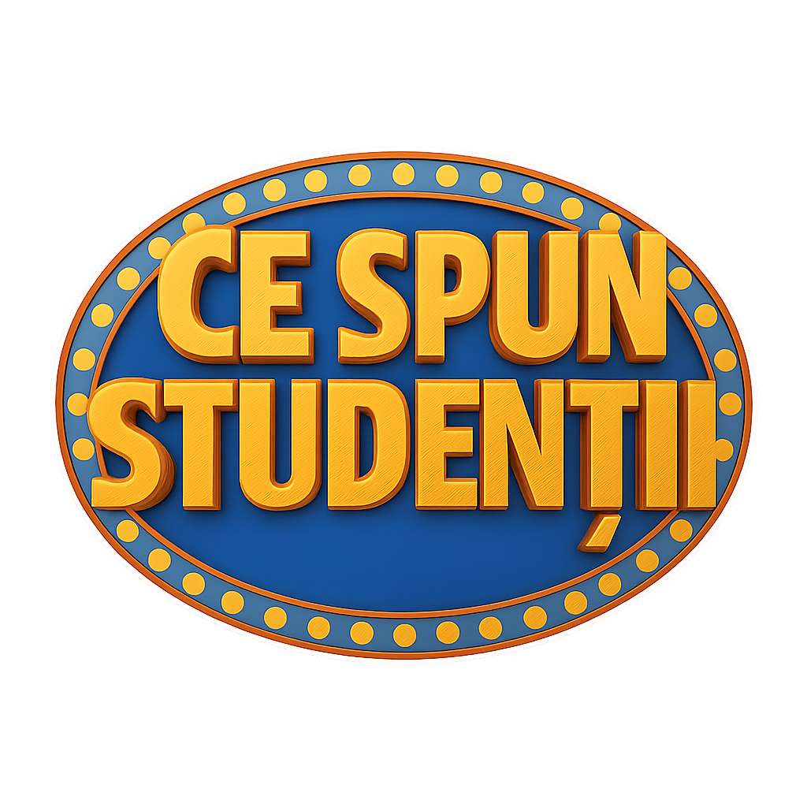

# Ce spun studentii 🎓🎮



## Overview

**Ce spun studentii** is a Unity-based project inspired by the classic **Family Feud** format, designed to explore and visualize student opinions, ideas, and experiences. The gameplay and interactions are modeled after the popular quiz show, where participants guess the most common answers to survey questions. The project leverages interactive scenes, custom animations, and engaging assets to create a dynamic environment for student expression. 🚀

> **Note:** This project is still a **work in progress**. Features, visuals, and functionality are actively being developed and improved.

## Features
- 🏆 Family Feud-style quiz gameplay
- 🎲 Interactive Unity scenes
- 🎬 Custom animations and prefabs
- 🖼️ Rich graphical assets
- 🧩 Modular scripts for extensibility
- 📂 Support for external file browsing and streaming assets

## Folder Structure
- `Assets/` - Main project assets, including scenes, scripts, prefabs, and images
- `Library/` - Unity-generated files (do not edit manually)
- `Packages/` - Package dependencies
- `ProjectSettings/` - Unity project settings

## Getting Started
1. Clone the repository: 💻
	```powershell
	git clone https://github.com/Mantelgen/Ce_spun_studentii.git
	```
2. Open the project in Unity (recommended version: 2021.3 or later). 🛠️
3. Explore the `Assets/Scenes` folder to start with available scenes. 🎉

## Contributing
Contributions are welcome! Please open issues or submit pull requests for suggestions, bug fixes, or new features. 🤝

## License
This project is licensed under the MIT License. See the [LICENSE](LICENSE) file for details. 📄

---

*Ce spun studentii* is developed and maintained by Mantelgen and contributors. 🙌